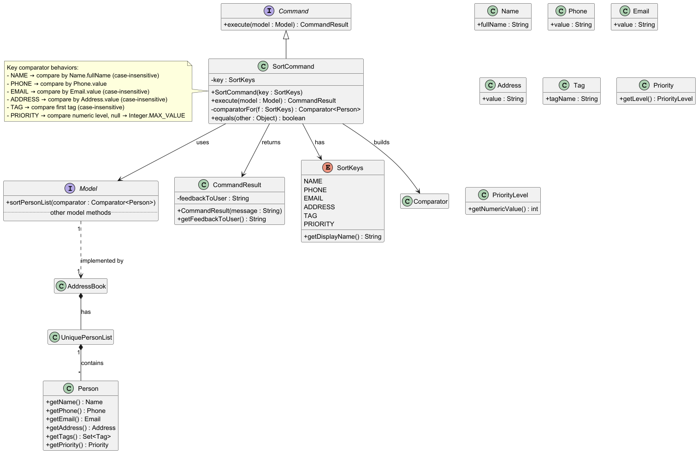

* Table of Contents
{:toc}

--------------------------------------------------------------------------------------------------------------------

## **Acknowledgements**

* se-edu/addressbook-level3 — project structure and developer guide layout used as inspiration. Some architecture and undo/redo documentation style is adapted. (https://github.com/se-edu/addressbook-level3)
* JUnit 5 testing patterns and assertions used throughout the test suites.
* JavaFX documentation and FXML usage patterns for UI parts.

--------------------------------------------------------------------------------------------------------------------

## **Setting up, getting started**

Refer to the guide [_Setting up and getting started_](SettingUp.md).

--------------------------------------------------------------------------------------------------------------------

## **Design**

<div markdown="span" class="alert alert-primary">

:bulb: **Tip:** The `.puml` files used to create diagrams are in this document `docs/diagrams` folder. Refer to the [_PlantUML Tutorial_ at se-edu/guides](https://se-education.org/guides/tutorials/plantUml.html) to learn how to create and edit diagrams.
</div>

### Architecture


The ***Architecture Diagram*** given above explains the high-level design of the App.

Given below is a quick overview of main components and how they interact with each other.

**Main components of the architecture**

**`Main`** (consisting of classes [`Main`](https://github.com/se-edu/addressbook-level3/tree/master/src/main/java/seedu/address/Main.java) and [`MainApp`](https://github.com/se-edu/addressbook-level3/tree/master/src/main/java/seedu/address/MainApp.java)) is in charge of the app launch and shut down.
* At app launch, it initializes the other components in the correct sequence, and connects them up with each other.
* At shut down, it shuts down the other components and invokes cleanup methods where necessary.

The bulk of the app's work is done by the following four components:

* **UI** — JavaFX-based user interface, separated into `UiPart` classes and FXML layout files in `src/main/resources/view`.
* **Logic** — Command parsing and execution layer. Exposes a `Logic` interface implemented by `LogicManager`.
* **Model** — In-memory representation of data (contacts, filtered lists, user prefs). Provides undo/redo hooks via `VersionedAddressBook` / `VersionedModel`.
* **Storage** — JSON-backed persistent storage for `AddressBook` and `UserPrefs`.

Each component defines an interface (e.g., `Logic`, `Model`, `Storage`) and a `*Manager` concrete implementation. Other components depend on the interfaces rather than concrete classes to reduce coupling.

### How the components interact

When a user types a command (for example `delete 1`):

1. The **UI** passes the raw command string to the **Logic** component.
2. **Logic** uses `AddressBookParser` to parse the string into a `Command` object.
3. The `Command` object executes using the **Model** API to manipulate data.
4. If the command modifies the model, the **Model** commits a new state (undo/redo history).
5. **Storage** persists the modified data to JSON.
6. The **UI** observes model changes and updates the rendered view.

A high-level sequence diagram is available at `images/ArchitectureSequenceDiagram.png`.

Each of the four main components (also shown in the diagram above),

* defines its *API* in an `interface` with the same name as the Component.
* implements its functionality using a concrete `{Component Name}Manager` class (which follows the corresponding API `interface` mentioned in the previous point.

For example, the `Logic` component defines its API in the `Logic.java` interface and implements its functionality using the `LogicManager.java` class which follows the `Logic` interface. Other components interact with a given component through its interface rather than the concrete class (reason: to prevent outside component's being coupled to the implementation of a component), as illustrated in the (partial) class diagram below.


The sections below give more details of each component.

### UI component

**API**: `Ui` interface (see `src/main/java/seedu/address/ui/Ui.java` in the original reference layout).

The UI uses JavaFX. Primary points:

* `MainWindow` composes the main visual parts: `CommandBox`, `ResultDisplay`, `PersonListPanel`, `StatusBarFooter`.
* Visual parts derive from `UiPart<T>`, which abstracts loading via FXML and connecting controllers with FXML roots. The tests include `UiPartTest` and `TestFxmlObject` to validate FXML loading logic.
* Optional fields on `Person` (email, address, company, note, priority) are displayed conditionally; helper methods exist in `PersonCard` and `PersonCardViewModel` to compute visible text and flags. Unit tests for these helpers are in `src/test/java/.../PersonCardTest.java` and `PersonCardViewModelTest.java`.

The UI communicates with `Logic` only (it has a reference to a `Logic` instance); it does not directly manipulate the `Model` or `Storage`.

### Logic component

**API**: `Logic` (implemented by `LogicManager`). The parsing subsystem is centered around `AddressBookParser` and many `*CommandParser` classes.

Key parsing & command classes in the codebase (also covered by parser unit tests):

* `AddressBookParser` — top-level parser that selects the appropriate `XYZCommandParser`.
* `ArgumentTokenizer`, `ArgumentMultimap`, and `Prefix` — support classes that extract flags like `n/`, `p/`, `e/`, `pr/` from the raw command string. `ArgumentTokenizerTest` ensures tokenization edge cases are handled.
* Individual parsers include `AddCommandParser`, `EditCommandParser`, `DeleteCommandParser`, `FindCommandParser`, `NoteCommandParser`, `PriorityCommandParser`, `SortCommandParser`, etc. Each has a dedicated test class (e.g., `AddCommandParserTest`, `EditCommandParserTest`, ...).

Command execution flow (high-level):

1. `LogicManager.execute(commandText)` calls `AddressBookParser.parse(commandText)`.
2. `AddressBookParser` returns a concrete `Command` (e.g. `DeleteCommand`).
3. `LogicManager` executes the `Command` by invoking its `execute(Model)` method.
4. The `Command` performs validations and calls `Model` APIs (e.g., `Model#setPerson`, `Model#addPerson`, `Model#commitAddressBook()`).
5. The `execute` method returns `CommandResult` which contains feedback to the UI.

Several command behaviors are covered by unit tests in `src/test/java/seedu/address/logic/commands` including `PriorityCommandTest`, `NoteCommandTest` (parser + command), `UndoCommandTest`, `RedoCommandTest`, `SortCommandTest`, etc.


### Model component
**API**: `Ui` interface (see `src/main/java/seedu/address/model/Model.java` in the original reference layout).


The `Model` stores the _single source of truth_ for the application state. In our codebase the important classes are:

* `Person` — domain object that holds contact fields (name, phone, email, address, company, note, priority, tags). See `src/main/java/seedu/address/model/person/Person.java`.
* `Priority` — represents priority levels as an enum-like `Level` with helper parsing, numeric mapping and display metadata (symbol, color). See `src/main/java/seedu/address/model/person/Priority.java` and tests in `PriorityTest`.
* `Note` — lightweight wrapper for remarks attached to a person. See `Note.java` and `NoteTest`.
* `UniquePersonList` — enforces uniqueness (name + phone) and is used by `AddressBook`.
* `AddressBook` / `VersionedAddressBook` — stores the `UniquePersonList` and (for versioned behaviour) maintains history for undo/redo.

**Design choices and rationale**

* `Person` keeps optional fields (email, address, company, note, priority) as nullable values. This reduces churn for users who want minimal contact entries and simplifies JSON storage of absent values. `PersonBuilder` and `JsonAdaptedPerson` handle `null` gracefully in parsing and serialization.
* Identity is defined as the tuple (name, phone). The `UniquePersonList` enforces this invariant; the codebase throws `DuplicatePersonException` when violated.
* `Priority` accepts both textual (`HIGH`, `MEDIUM`, `LOW`) and numeric inputs (`1`..`5`) and maps numeric ranges to levels (1-2 => HIGH, 3-4 => MEDIUM, 5 => LOW). This is reflected in parsing tests (`PriorityTest`) and command parser tests (`PriorityCommandParserTest`).


### Storage component

**API**: `Ui` interface (see `src/main/java/seedu/address/storage/Storage.java` in the original reference layout).


The `Storage` component handles reading and writing JSON files. Noteworthy classes and tests:

* `JsonAddressBookStorage` — read/write `AddressBook` to JSON. Unit tests live in `JsonAddressBookStorageTest` and use a temporary folder (`@TempDir`) for IO safety.
* `JsonUserPrefsStorage` — read/write `UserPrefs` (GUI settings, paths), tested in `JsonUserPrefsStorageTest`.
* `JsonAdaptedPerson` / `JsonAdaptedTag` — serialization adapters that convert between JSON-friendly structures and domain objects. `JsonAdaptedPersonTest` validates a wide range of null/invalid field behaviour.
* `StorageManager` — glue class that wires address book and prefs storage together. See `StorageManagerTest` for integration-level checks.

**Important behaviours tested**

* Missing or invalid JSON files are reported via `DataLoadingException` to avoid application crashes; tests assert these cases (`read_notJsonFormat_exceptionThrown`, `read_missingFile_emptyResult`).
* Serialization tolerates `null` optional fields; `toModelType` returns domain objects with `null` fields where appropriate (verified by `JsonAdaptedPersonTest#toModelType_nullFields_returnsPerson`).
* Saving to non-existent locations is handled — tests create temporary files and confirm correctness after save+load.

--------------------------------------------------------------------------------------------------------------------

## **Implementation**

This section describes some noteworthy details on how certain features are implemented.

### Undo/redo feature

The proposed undo/redo mechanism is facilitated by `VersionedAddressBook`. It extends `AddressBook` with an undo/redo history, stored internally as an `addressBookStateList` and `currentStatePointer`. Additionally, it implements the following operations:

* `VersionedAddressBook#commit()` — Saves the current address book state in its history.
* `VersionedAddressBook#undo()` — Restores the previous address book state from its history.
* `VersionedAddressBook#redo()` — Restores a previously undone address book state from its history.

These operations are exposed in the `Model` interface as `Model#commitAddressBook()`, `Model#undoAddressBook()` and `Model#redoAddressBook()` respectively.

Given below is an example usage scenario and how the undo/redo mechanism behaves at each step.

Step 1. The user launches the application for the first time. The `VersionedAddressBook` will be initialized with the initial address book state, and the `currentStatePointer` pointing to that single address book state.


Step 2. The user executes `delete 5` command to delete the 5th person in the address book. The `delete` command calls `Model#commitAddressBook()`, causing the modified state of the address book after the `delete 5` command executes to be saved in the `addressBookStateList`, and the `currentStatePointer` is shifted to the newly inserted address book state.


Step 3. The user executes `add n/David …​` to add a new person. The `add` command also calls `Model#commitAddressBook()`, causing another modified address book state to be saved into the `addressBookStateList`.


<div markdown="span" class="alert alert-info">:information_source: **Note:** If a command fails its execution, it will not call `Model#commitAddressBook()`, so the address book state will not be saved into the `addressBookStateList`.

</div>

Step 4. The user now decides that adding the person was a mistake, and decides to undo that action by executing the `undo` command. The `undo` command will call `Model#undoAddressBook()`, which will shift the `currentStatePointer` once to the left, pointing it to the previous address book state, and restores the address book to that state.


<div markdown="span" class="alert alert-info">:information_source: **Note:** If the `currentStatePointer` is at index 0, pointing to the initial AddressBook state, then there are no previous AddressBook states to restore. The `undo` command uses `Model#canUndoAddressBook()` to check if this is the case. If so, it will return an error to the user rather
than attempting to perform the undo.

</div>

The following sequence diagram shows how an undo operation goes through the `Logic` component:


<div markdown="span" class="alert alert-info">:information_source: **Note:** The lifeline for `UndoCommand` should end at the destroy marker (X) but due to a limitation of PlantUML, the lifeline reaches the end of diagram.

</div>

Similarly, how an undo operation goes through the `Model` component is shown below:


Step 5. After undoing, the user can type `redo` to restore the previously undone state. The redo command calls `Model#redoAddressBook()`, which shifts the `currentStatePointer` one step to the right and restores the corresponding state in memory.


<div markdown="span" class="alert alert-info">:information_source: **Note:** If the `currentStatePointer` is at index `addressBookStateList.size() - 1`, pointing to the latest address book state, then there are no undone AddressBook states to restore. The `redo` command uses `Model#canRedoAddressBook()` to check if this is the case. If so, it will return an error to the user rather than attempting to perform the redo.

The following sequence diagram shows how a redo operation goes through the `Logic` component:


<div markdown="span" class="alert alert-info">:information_source: **Note:** The lifeline for `RedoCommand` should end at the destroy marker (X) but due to a limitation of PlantUML, the lifeline reaches the end of diagram.

</div>

Similarly, how a redo operation goes through the `Model` component is shown below:


Step 6. The user then decides to execute the command `list`. Commands that do not modify the address book, such as `list`, will usually not call `Model#commitAddressBook()`, `Model#undoAddressBook()` or `Model#redoAddressBook()`. Thus, the `addressBookStateList` remains unchanged.


Step 7. The user executes `clear`, which calls `Model#commitAddressBook()`. Since the `currentStatePointer` is not pointing at the end of the `addressBookStateList`, all address book states after the `currentStatePointer` will be purged. Reason: It no longer makes sense to redo the `add n/David …​` command. This is the behavior that most modern desktop applications follow.


The following activity diagram summarizes what happens when a user executes a new command:


#### Design considerations:

**Aspect: How undo & redo executes:**

* **Alternative 1 (current choice):** Saves the entire address book.
  * Pros: Easy to implement.
  * Cons: May have performance issues in terms of memory usage.

* **Alternative 2:** Individual command knows how to undo/redo by
  itself.
  * Pros: Will use less memory (e.g. for `delete`, just save the person being deleted).
  * Cons: We must ensure that the implementation of each individual command are correct.

### Add

**Command format**  
`add n/NAME p/PHONE [e/EMAIL] [a/ADDRESS] [c/COMPANY] [pr/PRIORITY] [t/TAG]... [r/REMARKS]`

- Prefix constants are used throughout parsing code and test utilities (see `PersonUtil`), e.g. `PREFIX_NAME`, `PREFIX_PHONE`, `PREFIX_EMAIL`, `PREFIX_ADDRESS`, `PREFIX_TAG`, `PREFIX_PRIORITY`, `PREFIX_REMARK`, `PREFIX_COMPANY`, etc.
  * Example builder used in tests: `PersonUtil.getPersonDetails(person)` constructs strings using these prefixes. See:  
    `src/test/java/seedu/address/testutil/PersonUtil.java`

**Validation rules (derived from `ParserUtilTest` & model tests):**

* `Name`: Not null, not blank, must satisfy `Name.isValidName(...)`.
* `Phone`: Numeric only, ≥ 3 digits (`Phone.isValidPhone`).
* `Email` (optional): Must satisfy `Email.isValidEmail(...)`.
* `Address` (optional): Must satisfy `Address.isValidAddress(...)`.
* `Company` (optional): Must satisfy `Company.isValidCompany(...)`.
* `Priority` (optional): Must be one of `HIGH`, `MEDIUM`, `LOW` or numeric 1–5.
* `Note` / `Remarks` (optional): Must satisfy `Note.isValidNote(...)`.
* `Tags` (optional): Must satisfy `Tag.isValidTagName(...)`.

**Implementation steps (how Add is put together in code):**

1. **Parse**: `AddCommandParser.parse(String args)` uses `ParserUtil` methods to build fields. Throws `ParseException` if validations fail.
2. **Build Person**: Parsed values → new `Person` via constructor or `PersonBuilder`.
3. **Execute AddCommand**:
   * Calls `model.addPerson(person)`.
   * Commits model only after successful add (`model.commitAddressBook()`).
4. **Return result**: Returns `CommandResult` with success message.

**Important implementation points (Add):**

* Duplicate prevention via `DuplicatePersonException` (see `AddressBookTest`, `UniquePersonListTest`).
* `Company` blank → invalid (`CompanyTest`).
* Commit only on success.

**Key test references:**

- `ParserUtilTest`  
- `PersonBuilder.java`, `PersonUtil.java`, `TypicalPersons.java`  
- `AddressBookTest`, `UniquePersonListTest`

**Example:**
- `add n/Jane Doe p/91234567 e/jane@example.com a/123 Main St c/Acme pr/HIGH t/client r/Prefers email`


### Note


This is a class diagram representing `NoteCommand.java` file.

This is a class diagram representing `NoteCommandParser.java` file.


**Command format**  
`note INDEX r/REMARKS`  
(Entering `r/` with no text clears the note)

* Test examples:  
  * `note 1 r/Client prefers email`  
  * `note 1 r/` (clears note)

**Validation & semantics:**


* `Note.isValidNote(...)` accepts any printable text or `"-"`.
* Empty or whitespace-only → treated as placeholder `"-"`.
  * See:  
    `NoteCommandParserTest.parse_emptyNote_success()`  
    `ParserUtilTest.parseNote_whitespaceString_returnsPlaceholderNote()`

**Implementation steps:**


1. **Parse**:
   * `NoteCommandParser.parse(String args)` reads index + `r/`.
   * Empty remark → placeholder `"-"`.
   * Uses `ParserUtil.parseNote(...)`.
2. **Create NoteCommand**:
   * `new NoteCommand(Index, new Note(value))`
3. **Execute**:
  ## High-level purpose
`NoteCommand` **adds or updates a `Note`** (remark) for an existing `Person` in the address book.  
Steps:

1. Read filtered person list from `Model`.  
2. Validate index.  
3. Create a new `Person` with the updated `Note`.  
4. Replace the original `Person` in the `Model`.  
5. Commit the change (for undo/redo).  
6. Refresh the filtered list.  
7. Return a `CommandResult` with a success message.


---


**Key tests:**

- `NoteCommandParserTest`
- `ParserUtilTest` (`parseNote_*`)
- `NoteTest`

**Example:**
- `note 2 r/Client prefers weekends. Call after 3pm.`

### Priority

**Command format**  
`priority INDEX pr/PRIORITY`

* Accepted textual values: `HIGH`, `MEDIUM`, `LOW` (case-insensitive)  
* Accepted numeric values: `1`–`5`
* Accepted `` to clear priority

**Mapping:**

| Numeric | Level  |
|----------|---------|
| 1, 2     | HIGH    |
| 3, 4     | MEDIUM  |
| 5        | LOW     |

**Implementation steps**

1. **Parse**
   * `PriorityCommandParser.parse(String args)` tokenizes for index and `PREFIX_PRIORITY`.
   * If the `pr/` value is **blank** after trimming → treat as **clear** (`priority = null`).
   * Otherwise parse with `ParserUtil.parsePriority(raw)`.
2. **Create**
   * `new PriorityCommand(index, /* may be null */ priority)`
3. **Execute**
   * Build an edited `Person` where the priority is set to the parsed `Priority` **or cleared when null**.
   * `model.setPerson(original, edited)` and `model.commitAddressBook()`.
   * Return a message indicating either “Set priority …” or “Cleared priority …”.

**Important details:**
* `pr/` with **blank value** clears the person’s priority.
* Otherwise `pr/PRIORITY` must be one of HIGH, MEDIUM, LOW, or 1..5.
* Case-insensitive input accepted.
* Numeric 1–5 mapped to textual levels.
* Invalid (e.g., `0`, `6`, `URGENT`) → ParseException.

**Key tests:**

- `PriorityCommandParserTest`
- `PriorityTest`
- `PersonCardTest` / `PersonCardViewModelTest` (priority badge rendering)

**Example:**
- priority 3 pr/HIGH
- priority 1 pr/2
- priority 2 pr/low
- priority 3 pr/

### HelpCommand

**Command format**  
`help`  

**Important details:**

* Does **not** modify the model; therefore, it does **not** commit any changes.
* No arguments are accepted.
* Any extra input should cause a parse failure.
* You can also hover on Help at the menu bar and click 'Help F1' to open up the HelpWindow.

**Example:**

`help`
Opened help window.

**Important implementation points:**

The `help` command relies on the following files for the GUI implementation:

1. **`HelpWindow.java`**  
   - JavaFX controller for the help window.
   - Manages interaction with FXML elements, buttons, and labels.
   - Handles copying the user guide URL to the clipboard and opening the browser.

2. **`HelpWindow.fxml`**  
   - Defines the GUI layout of the help window.
   - Includes the copy button, open button, and help message label.

3. **`HelpWindow.css`** 
   - Provides styling for the help window, such as button appearance, font styles, and layout padding.


# Sort — implementation notes & tests

> Diagrams referenced  
> * Class diagram: shows `SortCommand` (has `key: SortKeys`) → builds `Comparator<Person>` → calls `Model#sortPersonList(Comparator)` → `AddressBook` → `UniquePersonList` → `Person` accessors.


> * Sequence diagram (bottom): shows the parse → command → execute flow and that sorting is performed by the model/addressbook/unique list (in-place), then `CommandResult` is returned.


---

## Command format
sort [CRITERION]

- If no args or only whitespace → **defaults to** `name`.  
- Valid criteria (case-insensitive): `name`, `phone`, `email`, `address`, `tag`, `priority`.

---

## High-level flow (parse → command → execute) — matches sequence diagram and code

1. `LogicManager` hands the raw user input to `AddressBookParser`.  
2. `AddressBookParser` delegates to `SortCommandParser` which:
   - trims the input string;
   - empty / whitespace-only → constructs `new SortCommand(SortKeys.NAME)` (default);
   - a single valid key token → constructs `new SortCommand(<that SortKeys>)`;
   - otherwise throws `ParseException` (invalid format or token).
3. `SortCommand.execute(Model model)` (as implemented in the provided code):
   1. `requireNonNull(model)`.
   2. `Comparator<Person> cmp = comparatorFor(key);` — `comparatorFor` returns the comparator for the selected `SortKeys` (detailed below).
   3. `model.sortPersonList(cmp);` — the model is asked to sort its person list using that comparator.
      - According to the sequence/class diagram and current code structure, that results in `AddressBook` delegating to `UniquePersonList.sort(cmp)`, which sorts the list **in-place** (i.e., mutates the model’s internal person ordering).
   4. `model.commitAddressBook();` — the command commits the change to the model (so sorting is treated as a model state change, enabling undo/redo).
   5. Build success message: `String.format(MESSAGE_SUCCESS, key.getDisplayName())`.
   6. `return new CommandResult(message)`.

> Important: the code **does** call `model.commitAddressBook()` (so sorting is currently a mutation and recorded for undo/redo). The diagrams show the in-place sort via `AddressBook / UniquePersonList` — this matches the code.

---

## How comparators are built (rules implemented in `comparatorFor`)
- `NAME` → compare `Person.getName().fullName`, case-insensitive.
- `PHONE` → compare `Person.getPhone().value` (string).
- `EMAIL` → compare `Person.getEmail().value`, case-insensitive.
- `ADDRESS` → compare `Person.getAddress().value`, case-insensitive.
- `TAG` → compare the **first tag** (by alphabetical order, case-insensitive):  
  `p.getTags().stream().map(tag->tag.tagName).sorted(String.CASE_INSENSITIVE_ORDER).findFirst().orElse("")`.  
  * Persons with no tags are treated as `""` for comparison.
- `PRIORITY` → compare numeric priority level via  
  `p.getPriority() != null ? p.getPriority().getLevel().getNumericValue() : Integer.MAX_VALUE`.  
  * Persons without a priority (`null`) get `Integer.MAX_VALUE` — they appear **after** any person with a numeric priority when sorting ascending.

If an unsupported key is passed, the code throws `IllegalArgumentException("Unsupported sort key: " + f)`.

---

## Class-level mapping (from the class diagram)
- `SortCommand` (fields / methods shown in class diagram and implemented in code):
  - field: `private final SortKeys key;`
  - constructor: `SortCommand(SortKeys key)`
  - `execute(Model model) : CommandResult` — builds comparator, calls `model.sortPersonList(cmp)`, `model.commitAddressBook()`, returns `CommandResult`.
  - `private comparatorFor(SortKeys f) : Comparator<Person>` — builds comparator per key (see rules above).
  - `equals(Object other)` — current implementation: `return other == this || other instanceof SortCommand;`  
    **Note:** that implementation treats any two `SortCommand` instances as equal regardless of `key`. This is inconsistent with the class diagram intent (and typical equals semantics). See **Tests & recommended fix** below.

- `Model` provides `sortPersonList(Comparator<Person>)` (diagram & code).  
- `AddressBook` implements `Model` and delegates the sort to `UniquePersonList`.  
- `UniquePersonList` contains `Person` objects and performs the in-place sorting.

**Example valid inputs:**
- sort
- sort name
- sort priority
- sort phone

**Key unit/parser tests (examples in repo):**
- src/test/java/seedu/address/logic/parser/SortCommandParserTest.java


*Tests include:*
* empty and whitespace inputs → default behavior
* valid single-key inputs (all supported keys)
* invalid inputs (multiple tokens, invalid key) → parse failure with `MESSAGE_INVALID_SORT_COMMAND_FORMAT`

**Notes for implementers:**
* If `SortCommand` relies on a `SortKeys` enum/class, ensure the parser maps strings case-insensitively to that enum.
* Keep sorting logic in `Model` (or a `Model#sortBy(SortKey)` helper) so `SortCommand` just delegates — this keeps separation of concerns and simplifies testing.


#### ModelManager

The concrete implementation is in `ModelManager` (`src/main/java/seedu/address/model/ModelManager.java`).

* **History storage**
  * `ModelManager` stores the history as a `List<AddressBook>` named `addressBookHistory`.
  * `historyPointer` is an `int` pointing to the current state within `addressBookHistory`.
  * Each saved state is a fresh `new AddressBook(this.addressBook)` copy (i.e., whole-state snapshots).

* **Committing**
  * `commitAddressBook()` calls a helper `pushCurrentStateToHistory()` which:
    * Removes any states after `historyPointer` (purging redo history) using:
      ```java
      while (addressBookHistory.size() > historyPointer + 1) {
          addressBookHistory.remove(addressBookHistory.size() - 1);
      }
      ```
    * Adds a deep snapshot `new AddressBook(this.addressBook)` to `addressBookHistory`.
    * Sets `historyPointer = addressBookHistory.size() - 1;`
  * Initial commit is performed by the constructors: both constructors call `commitAddressBook()` so there is always an initial state in history.

* **Undo**
  * `canUndoAddressBook()` returns `historyPointer > 0`.
  * `undoAddressBook()`:
    * Throws `IllegalStateException` if `canUndoAddressBook()` is false.
    * Decrements `historyPointer`.
    * Reads `AddressBook previous = addressBookHistory.get(historyPointer);`
    * Calls `this.addressBook.resetData(previous);` to restore the state.
    * Calls `updateFilteredPersonList(PREDICATE_SHOW_ALL_PERSONS);` to reset any filtered view.

* **Redo**
  * `canRedoAddressBook()` returns `historyPointer < addressBookHistory.size() - 1`.
  * `redoAddressBook()`:
    * Throws `IllegalStateException` if `canRedoAddressBook()` is false.
    * Increments `historyPointer`.
    * Reads `AddressBook next = addressBookHistory.get(historyPointer);`
    * Calls `this.addressBook.resetData(next);` to restore the state.
    * Calls `updateFilteredPersonList(PREDICATE_SHOW_ALL_PERSONS);` to reset any filtered view.

* **Snapshot semantics**
  * History stores **whole AddressBook snapshots** (not command diffs).
  * Purging behaviour: when committing while `historyPointer` is not at the last index, later states are removed (redo history is discarded) prior to appending the new commit.

(Implementation source: `ModelManager.java`.)

---

#### Command-level classes (UndoCommand / RedoCommand)

The undo/redo CLI commands are implemented in:

* `src/main/java/seedu/address/logic/commands/UndoCommand.java`
* `src/main/java/seedu/address/logic/commands/RedoCommand.java`

Key points from those classes:

* `UndoCommand` behavior:
  * Command word: `undo`
  * Success message: `"Undid previous action."`
  * Failure message: `"No actions to undo."`
  * Execution steps:
    1. `requireNonNull(model);`
    2. Check `if (!model.canUndoAddressBook())` → throw `CommandException(MESSAGE_FAILURE)`.
    3. Call `model.undoAddressBook();` inside try/catch. If `IllegalStateException` occurs, convert to `CommandException(MESSAGE_FAILURE)`.
    4. Return `new CommandResult(MESSAGE_SUCCESS);`

* `RedoCommand` behavior:
  * Command word: `redo`
  * Success message: `"Redid previous action."`
  * Failure message: `"No actions to redo."`
  * Execution steps mirror `UndoCommand` but use `canRedoAddressBook()` and `model.redoAddressBook()`.

(Execution/error message behaviour: see `UndoCommand.java` and `RedoCommand.java`.)


--------------------------------------------------------------------------------------------------------------------

## **Documentation, logging, testing, configuration, dev-ops**

* [Documentation guide](Documentation.md)
* [Testing guide](Testing.md)
* [Logging guide](Logging.md)
* [Configuration guide](Configuration.md)
* [DevOps guide](DevOps.md)

--------------------------------------------------------------------------------------------------------------------

## **Appendix: Requirements**

### Product scope

**Target user profile**:

* Freelance professionals and consultants who manage multiple client relationships
* has a need to manage a significant number of client contacts
* prefer desktop apps over other types
* can type fast and prefer typing over mouse/voice commands
* is reasonably comfortable using CLI apps
* need quick access to client information for project management

**Value proposition**: Eliminates time-consuming contact searches and data entry by providing instant CLI-based access to client information, allowing freelancers to manage client relationships more efficiently than traditional GUI apps.


### User stories

Priorities: High (must have) - `* * *`, Medium (nice to have) - `* *`, Low (unlikely to have) - `*`

| Priority | As a …​                                    | I want to …​                     | So that I can…​                                                        |
| -------- | ------------------------------------------ | ------------------------------ | ---------------------------------------------------------------------- |
| `* * *`  | freelance professional | add new client contacts quickly | build my client database efficiently |
| `* * *`  | freelance professional | find clients by name | quickly access their contact information |
| `* * *`  | freelance professional | delete outdated contacts | keep my database clean and current |
| `* * *`  | freelance professional | view all my contacts | see my entire client base at a glance |
| `* *`    | freelance professional | edit client details | update information when clients change contact details |
| `* *`    | freelance professional | add notes to contacts | track project details and meeting summaries |
| `* *`    | freelance professional | tag contacts by category | organize clients by project type or priority |
| `* *`    | freelance professional | search contacts by company | find all contacts from a specific organization |
| `*`      | freelance professional | sort contacts alphabetically | locate clients more systematically |
| `*`      | freelance professional | export contact data | backup or share client information |

*{More to be added}*

## Use Cases

> For all use cases below, the **System** is `QuickCLI` and the **Actor** is the **user**, unless specified otherwise.

---

### UC01 — Add a new client contact

**MSS**
1. User requests to add a new contact with name and phone number.
2. QuickCLI validates the input format.
3. QuickCLI checks for duplicate contacts.
4. QuickCLI adds the contact to the database.
5. QuickCLI displays success message with contact details.  
   **Use case ends.**

**Extensions**
- 2a. Invalid input format (e.g., missing required fields, invalid phone number).  
  2a1. QuickCLI shows specific error message.  
  2a2. User enters corrected command.  
  *Use case resumes at step 2.*

- 3a. Duplicate contact exists (same name and phone).  
  3a1. QuickCLI shows duplicate warning and the existing contact.  
  *Use case ends.*

---

### UC02 — Find contacts (across all fields)

**MSS**
1. User requests to find contacts with keyword(s).
2. QuickCLI searches **across all fields** (name, phone, email, address, company, tags, priority).
3. QuickCLI displays the filtered list of matching contacts.  
   **Use case ends.**

**Extensions**
- 2a. No contacts match the search criteria.  
  2a1. QuickCLI shows “0 contacts found.”  
  *Use case ends.*

---

### UC03 — Add or update notes for a contact

**MSS**
1. User requests to list all contacts.
2. QuickCLI shows the list with indices.
3. User requests to add/update a note for a specific contact by index.
4. QuickCLI saves the note to the contact.
5. QuickCLI displays success message.  
   **Use case ends.**

**Extensions**
- 2a. The contact list is empty.  
  *Use case ends.*

- 3a. Invalid index is provided.  
  3a1. QuickCLI shows error message.  
  *Use case resumes at step 3.*

- 3b. Note exceeds the character limit.  
  3b1. QuickCLI shows error about the limit.  
  *Use case resumes at step 3.*

---

### UC04 — Edit an existing contact

**MSS**
1. User requests to edit a contact by index and supplies one or more fields to change.
2. QuickCLI validates each supplied field.
3. QuickCLI updates the contact details.
4. QuickCLI displays success message with the updated contact.  
   **Use case ends.**

**Extensions**
- 1a. No fields are supplied.  
  1a1. QuickCLI shows “Please provide at least one field to update.”  
  *Use case ends.*

- 2a. Invalid index.  
  2a1. QuickCLI shows error message.  
  *Use case ends.*

- 2b. A field is invalid (e.g., phone not 3–15 digits, malformed email).  
  2b1. QuickCLI shows a specific validation error.  
  *Use case resumes at step 1.*

- 3a. The edit would create a duplicate (same name + phone as another contact).  
  3a1. QuickCLI shows duplicate warning.  
  *Use case ends.*

- 3b. User clears the priority with an empty value (`pr/`).  
  3b1. QuickCLI removes the priority from the contact.  
  *Use case returns to step 4.*

---

### UC05 — Set or clear a contact’s priority

**MSS**
1. User requests to set a priority for a contact by index (e.g., `priority 3 pr/HIGH` or numeric `1–5`).
2. QuickCLI validates the priority value.
3. QuickCLI updates the contact’s priority.
4. QuickCLI displays success message.  
   **Use case ends.**

**Extensions**
- 1a. Invalid index.  
  1a1. QuickCLI shows error message.  
  *Use case ends.*

- 2a. Invalid priority token (not HIGH/MEDIUM/LOW or 1–5).  
  2a1. QuickCLI shows usage message clarifying accepted values (including `2` and `4`).  
  *Use case resumes at step 1.*

- 3a. User clears the priority with an empty value (`priority 3 pr/`).  
  3a1. QuickCLI removes the priority and shows a confirmation message.  
  *Use case ends.*

---

### UC06 — List all contacts / filter by tag

**MSS**
1. User requests to list contacts (optionally with a single tag filter `t/TAG`).
2. QuickCLI shows the list (or the filtered list by tag).  
   **Use case ends.**

**Extensions**
- 1a. Multiple tag prefixes are supplied when only one is supported.  
  1a1. QuickCLI shows an error clarifying expected usage (single tag or error).  
  *Use case ends.*

- 2a. No contacts match the tag filter.  
  2a1. QuickCLI shows “0 contacts found.”  
  *Use case ends.*

---

### UC07 — Sort the contact list

**MSS**
1. User requests to sort contacts (e.g., `sort`, `sort name`, `sort priority`).
2. QuickCLI validates the sort key (defaults to name if omitted).
3. QuickCLI sorts and updates the displayed order.
4. QuickCLI displays success message.  
   **Use case ends.**

**Extensions**
- 2a. Unsupported sort key is provided.  
  2a1. QuickCLI shows usage message with valid keys.  
  *Use case resumes at step 1.*

---

### UC08 — Delete one or more contacts

**MSS**
1. User requests to delete contact(s) by index / comma list / range.
2. QuickCLI validates all indices.
3. (If multiple) QuickCLI asks for confirmation.
4. QuickCLI deletes the specified contact(s).
5. QuickCLI displays success message.  
   **Use case ends.**

**Extensions**
- 2a. One or more indices are invalid.  
  2a1. QuickCLI lists invalid indices and cancels the operation.  
  *Use case ends.*

- 3a. User cancels the confirmation.  
  3a1. QuickCLI aborts delete.  
  *Use case ends.*

- 4a. Deletion performed from a filtered list (after `find`).  
  4a1. QuickCLI deletes the contact at the given **filtered** index.  
  *Use case continues at step 5.*

---

### UC09 — Undo last action

**MSS**
1. User requests `undo`.
2. QuickCLI checks that there is a previous state.
3. QuickCLI restores the previous state.
4. QuickCLI displays success message.  
   **Use case ends.**

**Extensions**
- 2a. No previous state is available.  
  2a1. QuickCLI shows “No actions to undo.”  
  *Use case ends.*

---

### UC10 — Redo last undone action

**MSS**
1. User requests `redo`.
2. QuickCLI checks that there is an undone state to reapply.
3. QuickCLI reapplies the next state.
4. QuickCLI displays success message.  
   **Use case ends.**

**Extensions**
- 2a. No redo is available (e.g., user performed a new mutating command after undo).  
  2a1. QuickCLI shows “No actions to redo.”  
  *Use case ends.*

- **Illustrative example**  
  - User runs `add n/A p/111`.  
  - User runs `delete 1`.  
  - User runs `undo` → restores contact A.  
  - User runs `redo` → deletes A again (works).  
  - User runs `undo` → restores A.  
  - **User runs `edit 1 p/222` (new change)** → redo history is cleared.  
  - User runs `redo` → **fails** (“No actions to redo.”) because a new change broke the redo chain.

---

### UC11 — Clear all contacts

**MSS**
1. User requests `clear`.
2. QuickCLI prompts for confirmation (e.g., `clear confirm`).
3. User confirms.
4. QuickCLI deletes all contacts and shows success message.  
   **Use case ends.**

**Extensions**
- 2a. User does not confirm.  
  2a1. QuickCLI cancels clear.  
  *Use case ends.*

---

### UC12 — View help

**MSS**
1. User requests `help` (or presses `F1`).
2. QuickCLI opens the Help Window and/or shows a help message.  
   **Use case ends.**

**Extensions**
- 1a. Help Window is already open.  
  1a1. QuickCLI focuses the existing Help Window.  
  *Use case ends.*

---

### Non-Functional Requirements

1.  **Performance**: Should execute any command in less than 100ms for typical usage.
2.  **Capacity**: Should be able to hold up to 1000 contacts without noticeable sluggishness in performance.
3.  **Usability**: A user with above average typing speed should be able to accomplish tasks faster using CLI commands than using mouse interactions.
4.  **Compatibility**: Should work on any _mainstream OS_ as long as it has Java `17` or above installed.
5.  **Portability**: Should work without requiring installer or admin rights (portable executable).
6.  **Data Integrity**: Should save data automatically after each command that modifies data.
7.  **Reliability**: Should handle invalid commands gracefully with clear error messages.
8.  **Learning Curve**: New users should be able to use basic commands within 5 minutes of reading the user guide.
9.  **Data Format**: Data should be stored in human-readable JSON format for easy backup and manual editing if needed.
10. **Screen Resolution**: Should be usable on screens with resolution of 1280x720 or higher.

*{More to be added}*

### Glossary

| **Term** | **Definition / Explanation** | **Example** |
|-----------|------------------------------|--------------|
| **CLI (Command Line Interface)** | A text-based interface where users type commands to interact with software. | `QuickCLI` uses a CLI to manage contacts. |
| **GUI (Graphical User Interface)** | A visual interface where users interact with software using windows, buttons, and icons. | `QuickCLI` has a GUI overlay for visual representation. |
| **Contact** | A record representing a client, including name, phone, email, company, tags, and remarks. | `add n/John Doe p/91234567` |
| **Index** | The number representing a contact in the current list, used in commands like edit, delete, note. | `edit 2 n/Jane Smith` |
| **Priority** | A level assigned to a contact indicating their importance or urgency. | `pr/HIGH`, `pr/MEDIUM`, `pr/LOW`, `pr/1` |
| **Tag** | A keyword used to categorize or filter contacts. | `t/client`, `t/priority`. |
| **Remark / Note** | Optional textual information about a contact, stored for reference. | `r/Prefers Email Communication.` |
| **Command Format / Syntax** | The structure in which a command must be entered. | `add n/NAME p/PHONE [e/EMAIL]...` |
| **Duplicate Contact** | A contact considered identical to an existing one if both name and phone number match. | `QuickCLI` prevents duplicates. |
| **Sort Criterion** | A property used to organize contacts when using the `sort` command. | `name` for alphabetical, `recent` for newest first. |
| **Clear Confirm** | A confirmation step to prevent accidental deletion of all contacts. | User types `clear confirm` to execute clear. |
| **JSON** | A text-based format for storing structured data. | `QuickCLI` stores contacts in JSON format. |
| **User Story** | Short description of a feature from the user’s perspective. | “As a user, I can add a contact so that I can manage client info quickly.” |
| **Help Window** | A GUI window that lists all available commands and syntax. | Opened using `help`. |
| **Clock Button** | A button beside notes showing the time the note was added. | Only active if a note exists. |
| **Exit** | Command to close QuickCLI; automatically saves data. | `exit` |
| **Save Data** | Automatic saving of changes to the database after commands that modify data. | Stored in `quickcli.json`. |
| **Add Command** | Adds a new contact to QuickCLI. | `add n/John Doe p/91234567` |
| **List Command** | Lists all contacts or filtered by tags. | `list t/priority` |
| **Find Command** | Searches contacts by keyword(s). | `find john mary` |
| **Edit Command** | Updates details of an existing contact. | `edit 2 n/Jane Smith p/91234567` |
| **Delete Command** | Removes a contact from the database. | `delete 3` |
| **Note Command** | Adds remarks to a contact. | `note 1 r/Meeting scheduled` |
| **Sort Command** | Organizes contacts according to a criterion. | `sort name` or `sort recent` |
| **Clear Command** | Deletes all contacts from the database. | Must type `clear confirm` to proceed. |
| **Help Command** | Launches the Help Window. | `help` |
| **JSON** |JavaScript Object Notation - A human-readable data format used to store contact data |
| **Mainstream OS** |Operating System that is mainstream |Windows, Linux, Unix, MacOS |
| **Freelance Professional** |Self-employed individual offering services to multiple clients |

--------------------------------------------------------------------------------------------------------------------

## Appendix: Instructions for manual testing (expanded)

> Note: These instructions complement the User Guide and are written for the tester who needs a quick, reproducible path through the app features. They are not exhaustive; exploratory testing is encouraged.

### Basic tests

1. `list` — app should show the sample contacts and return success.
2. `add n/Test User p/91234567` — new contact created and visible in top of list (or bottom depending on sort), success message appears.
3. `find Test` — the previously added contact should be shown.
4. `edit 1 p/99999999` — the phone of the first visible contact should update.
5. `note 1 r/Meeting notes` — note should be saved and `Note:` visible in person card (or `-` placeholder cleared).
6. `priority 1 pr/HIGH` — the contact’s priority should update and any visual badge updated.
7. `delete 1` — deletion happens; confirm address book updated in UI and status bar.
8. `undo` (if implemented) — the last mutation is undone. 
9. `redo` to reapply.
10. `clear` then `clear confirm` — all entries deleted; check that data file was updated.

### Edge cases and invalid input tests

1. Try `add` with missing required fields — should show a helpful error (missing name/phone).
2. Try `delete 9999` — out-of-range index should be rejected.
3. Try `note 1 r/` (empty note) — should clear note and show placeholder behavior.
4. Try `priority 1 pr/URGENT` — invalid priority should be rejected with usage message.
5. Try duplicate add: add the same name & phone twice — second add should be rejected.

### Manual testing for sorting & filtering

1. Use `sort` and `sort priority` and `sort recent` — check correct ordering in the list pane.
3. Use `find` with partial keywords and mixed-case (e.g., `find JoH`) — confirm case-insensitive partial matches.
