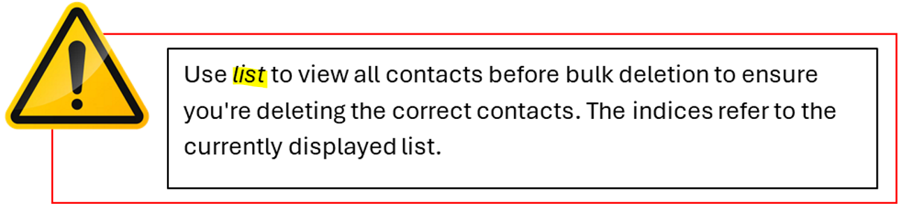
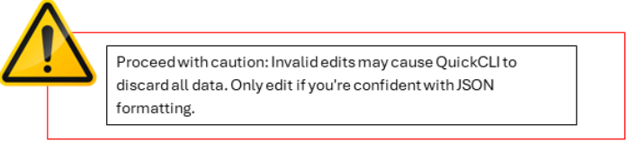

# **QuickCLI User Guide**

## **Table of Contents**

- [About: How to use the guide](#about-how-to-use-the-guide)
- [Product Overview](#product-overview)
- [Quick Start](#quick-start)
- [Features](#features)
  - [Understanding the Command Format](#understanding-the-command-format)
  - [Adding a contact: add](#adding-a-contact-add)
  - [Listing all contacts: list](#listing-all-contacts-list)
  - [Finding contacts: find](#finding-contacts-find)
  - [Editing a contact: edit](#editing-a-contact-edit)
  - [Adding notes to a contact: note](#adding-notes-to-a-contact-note)
  - [Setting priority for a contact: priority](#setting-priority-for-a-contact-priority)
  - [Deleting a contact: delete](#deleting-a-contact-delete)
  - [Sorting contacts: sort](#sorting-contacts-sort)
  - [Clearing all contacts: clear](#clearing-all-contacts-clear)
  - [Undo last action: undo](#undo-last-action-undo)
  - [Redo undone action: redo](#redo-undone-action-redo)
  - [Viewing help: help](#viewing-help-help)
  - [Exiting the program: exit](#exiting-the-program-exit)
- [Data Management](#data-management)
  - [Saving the data](#saving-the-data)
  - [Editing the data file](#editing-the-data-file)
- [FAQ](#faq)
- [Command Summary](#command-summary)
- [Troubleshooting](#troubleshooting)
- [Contact & Support](#contact--support)
- [Glossary](#glossary)

--------------------------------------------------------------------------------------------------------------------

## **About: How to use the guide**

Words highlighted in <mark> yellow </mark> represent commands that should be typed into the **command terminal** in QuickCLI under the [Features](#features) section.

**Tip Boxes** provide additional guidance or useful hints to help you use QuickCLI more effectively:

**Warning Boxes** alert you about something important, risky, or potentially destructive.

--------------------------------------------------------------------------------------------------------------------

## Product Overview

QuickCLI is a **desktop application for freelance professionals** who need to manage multiple client relationships efficiently. Optimized for users who can type fast, QuickCLI allows you to manage your contacts faster than traditional GUI applications through a Command Line Interface (CLI), while still providing the visual benefits of a Graphical User Interface (GUI).

**Perfect for:** Freelance developers, designers, writers, marketers, and consultants who value keyboard efficiency and need quick access to client information.

--------------------------------------------------------------------------------------------------------------------

## Quick Start

- **Check System Requirements**
  - Ensure you have Java 17 or above installed on your computer, follow the Instruction Guide for Windows users [here](https://se-education.org/guides/tutorials/javaInstallationWindows.html)
  - Mac users: Follow the Instruction Guide [here](https://se-education.org/guides/tutorials/javaInstallationMac.html)
- **Download QuickCLI**
  - Download the latest quickcli.jar file from our release page [here](https://github.com/AY2526S1-CS2103T-W09-4/tp/releases/tag/v0.3.1)
- **Set Up the Application**
  - Create a folder where you want to store QuickCLI (e.g., C:\\QuickCLI or ~/QuickCLI)
  - Copy the downloaded JAR file into this folder
- **Launch QuickCLI**
  - Open a command terminal/console
    - For Windows users, you can use the Command Prompt:

- - 1. For Mac Users, you can use the Terminal:

- 1. Navigate to the folder: cd path/to/quickcli/folder
  - Run the application: java -jar quickcli.jar
  - The GUI should appear in a few seconds with some sample data
  - You should see:
    - A contact list panel displaying sample contacts
    - A command input box at the top where you'll type commands
    - A result display panel showing command feedback
    

- **Try Your First Commands** Type these commands in the command box and press Enter:
  - <mark> list </mark> - View all contacts
  - <mark> add n/Jane Smith p/91234567 </mark> - Add a new contact
  - <mark> find John </mark> - Search for contacts named John
  - <mark> help </mark> - View available commands

--------------------------------------------------------------------------------------------------------------------

## **Features**

### **Understanding the Command Format**

Before diving into specific commands, here's how you read the command syntax:

- **Words in UPPER_CASE** are parameters you need to provide
  - Example: add n/NAME means replace NAME with actual name like add <mark> add n/John Doe </mark>
- **Items in square brackets [\]** are optional
  - Example: n/NAME [t/TAG\] can be used as n/John Doe t/client or just n/John Doe
- **Items with ...** can be used multiple times (including zero)
  - Example: [t/TAG\]... can be omitted **OR**
  - Used once: t/designer **OR**
  - Multiple times t/designer t/priority
- **Parameters can be in any order**
  - Example: n/NAME p/PHONE is the same as p/PHONE n/NAME
- **Extraneous parameters** for commands that don't take parameters (like help, exit, clear) will be ignored
  - Example: <mark> help 123 </mark> will be interpreted as help

### **Managing Contacts**

#### Adding a contact: add

Adds a new client contact so you can manage your client list in QuickCLI.

**Format:** <mark> add n/NAME p/PHONE [e/EMAIL\] [a/ADDRESS\] [c/COMPANY\] [pr/PRIORITY\] [t/TAG\]... [r/REMARKS\] </mark> 

**Parameters:**

<table><tbody><tr><th>
<strong>Parameter</strong>
</th><th>
<strong>Definition / Explanation</strong>
</th></tr><tr><td>
n/NAME
</td><td>
Client's name (required)
<ul><li>Alphanumeric characters and spaces only</li><li>1-100 characters</li></ul></td></tr><tr><td>
p/PHONE
</td><td>
Phone number (required)
<ul><li>Numbers only, 3-15 digits</li></ul></td></tr><tr><td>
e/EMAIL
</td><td>
Email address (optional)
<ul><li>Must be valid email format</li></ul></td></tr><tr><td>
a/ADDRESS
</td><td>
Address (optional)
</td></tr><tr><td>
c/COMPANY
</td><td>
Company name (optional)
<ul><li>Can include letters, numbers, spaces, and . , &amp; -</li></ul></td></tr><tr><td>
t/TAG
</td><td>
Tags for categorization (optional, multiple allowed)
<ul><li>Single word, alphanumeric only</li></ul></td></tr><tr><td>
pr/PRIORITY
</td><td>
Priority level (optional)
<ul><li>Can be HIGH, MEDIUM, or LOW (case-insensitive)</li><li>Or numeric: 1-2 = HIGH, 3-4 = MEDIUM, 5 = LOW<ul><li>For more details on this feature, refer to Section: <a href="#setting-priority-for-a-contact-priority">Setting priority for a contact: priority</a></li></ul></li></ul></td></tr><tr><td>
r/REMARKS
</td><td><ul><li>Add remarks or project details to a contact (optional)<ul><li>For more details on this feature, refer to Section: <a href="#adding-notes-to-a-contact-note">Adding notes to a contact: note</a></li></ul></li></ul></td></tr></tbody></table>

**Examples:**

| **Command** | **You have added Client...** |
| --- | --- |
| <mark> add n/John Doe p/98765432 </mark>  | John Doe - name, phone |
| <mark> add n/Sarah Chen p/91234567 e/sarah@design.co c/Chen Designs t/designer t/priority </mark> | Sarah Chen - name, phone; optional: email, company, 2 tags |
| <mark> add n/Mike Wong p/87654321 e/mike@techcorp.com t/developer r/Prefers Email Communication </mark>| Mike Wong - name, phone; optional: email, tag, remark |
| <mark> add n/Jane Smith p/92345678 e/jane@urgentclient.com pr/HIGH t/priority </mark> | Jane Smith - name, phone; optional: email, priority |

**Note:** QuickCLI prevents duplicate contacts. Two contacts are considered duplicates if they have the same name AND phone number.

#### Listing all contacts: list

Shows all contacts in your database. You can also filter by tags.

**Format:**

- <mark> list </mark> - Shows all contacts
- <mark> list t/TAG </mark> - Shows contacts with specific tag (learn about tags in the add command section)

**Examples:**

<mark> list </mark>

<mark> list t/priority </mark> 

<mark> list t/designer </mark>

**Rules & notes:**
- At most **one** `t/` is allowed.  
  `list t/friends t/colleagues`
  
  

  
#### Finding contacts: find

Searches across all fields including name, phone, email, address, company, tags, and priority level.

**Format:** <mark> find KEYWORD [MORE_KEYWORDS\] </mark>

- Search is case-insensitive (john matches John)
- Partial matching is supported (Joh matches John)
- Multiple keywords use OR logic (find john marys all Johns OR Marys)

**Examples:**

- <mark> find john </mark>
- <mark> find chen wong </mark>
- <mark> find design </mark>
- <mark> find HIGH </mark> (finds all high-priority contacts)
- <mark> find urgent high </mark> (finds contacts with "urgent" OR "high" in any field)

### **Modifying Contact Information**

#### Editing a contact: edit

Updates the details of an existing contact.

**Format:** <mark> edit INDEX [n/NAME\] [p/PHONE\] [e/EMAIL\] [a/ADDRESS\] [c/COMPANY\] [pr/PRIORITY\] [t/TAG\]... [r/REMARKS\] </mark>

- Edit the contact at the specified INDEX (shown in the contact list)
- At least one field must be provided

**Examples:**

- <mark> edit 1 p/91234567 </mark>
- <mark> edit 2 n/John Smith [e/john@newcompany.com](mailto:e/john@newcompany.com) </mark>
- <mark> edit 3 t/priority t/developer </mark>
- <mark> edit 2 pr/MEDIUM t/important </mark>
- <mark> edit 4 t/ </mark>

#### Adding notes to a contact: note

Add remarks or project details to a contact.

**Format:** <mark> note INDEX r/REMARKS </mark>

- Adds notes to the contact at the specified INDEX
- Replaces any existing notes
- Maximum 500 characters
- The **clock button** appears next to each note added to a contact.

- Clicking the clock button displays the **timestamp** showing when the note was added.

- If no note exists, the icon only appears on hover.

**Examples:**

<mark> note 1 r/Discussed new website project, budget \$5000 </mark> 
<mark> note 2 r/Meeting scheduled for next Tuesday, 2pm  </mark>
 

#### Setting priority for a contact: priority
 Assign or update the priority level for a contact to help you focus on important clients.  
 **Format:** priority INDEX pr/PRIORITY
- `pr/` with **blank value** clears the person’s priority.
- Otherwise `pr/PRIORITY` must be one of HIGH, MEDIUM, LOW, or 1..5.
- Set priority for the contact at the specified INDEX
- Replaces any existing priority level
- Priority levels: HIGH, MEDIUM, LOW (case-insensitive)
- Alternative: Use numbers 1-5 (1-2 = HIGH, 3-4 = MEDIUM, 5 = LOW)

**Visual indicators:**

- **HIGH** priority: Red badge with \`!!!\` symbol
- **MEDIUM** priority: Orange badge with \`!!\` symbol
- **LOW** priority: Green badge with \`!\` symbol

**Parameters:**

- pr/PRIORITY: Priority level 
- Valid values: \`HIGH\`, \`MEDIUM\`, \`LOW\`, or \`1\`, \`2\`, \`3\`, \`4\`, \`5\`, \`\`
- Case-insensitive

**Examples:**

- <mark> priority 1 pr/HIGH </mark>
- <mark> priority 2 pr/medium </mark>
- <mark> priority 3 pr/1 </mark>
- <mark> priority 2 pr/ </mark> *(clears priority for contact #2)*

#### Deleting a contact: delete

Removes one or multiple contacts from your database.

**Format:**
- Single deletion: <mark> delete INDEX </mark>
- Multiple deletion: <mark> delete INDEX1,INDEX2,INDEX3 </mark>
- Range deletion: <mark> delete START-END </mark>
- Combined: <mark> delete INDEX1,INDEX2,START-END </mark>

**Parameters:**
- INDEX: The contact number shown in the current list (must be positive integer)
- Multiple indices can be separated by commas
- Ranges can be specified with a hyphen (e.g., 5-7 deletes contacts 5, 6, and 7)
- Can combine individual indices and ranges (e.g., 1,3,5-7,10)

**Bulk Delete Confirmation:**
When deleting multiple contacts (2 or more), QuickCLI will show a confirmation dialog to prevent accidental deletion. Click "YES" to proceed or "NO" to cancel.

<box type="warning" seamless>
Warning: Bulk delete operations cannot be undone. Always verify the indices before confirming deletion.
</box>

**Examples:**

**Single deletion:**
<mark>delete 3</mark> - Deletes contact at index 3 (e.g., Charlotte Oliveiro)

**Multiple deletion:**
<mark>delete 1,3,5</mark> - Deletes contacts at indices 1, 3, and 5

**Range deletion:**
<mark>delete 2-4</mark> - Deletes contacts from index 2 to 4 (inclusive)

**Combined deletion:**
<mark>delete 1,3,5-7,10</mark> - Deletes contacts at indices 1, 3, 5, 6, 7, and 10

**After using find:**

<mark>find roy</mark>

<mark>delete 1</mark>

Deletes the first contact in the filtered results (e.g., Roy Balakrishnan)

<box type="tip" seamless>

</box>

**Error Handling:**
- If any index is invalid, QuickCLI will display all invalid indices and the operation will be cancelled
- Example: <mark>delete 1,3,50</mark> when only 10 contacts exist will show: "Invalid indices: 50 (person list has 10 entries)"

### **Organizing Your Contacts**

#### Sorting contacts: sort

Organize your contact list for easier access.

**Format:** <mark> sort [CRITERION\] </mark>

**Available sorting options:**

- sort or sort name - Alphabetical by name (default)
- sort phone
- sort email
- sort address
- sort tag - Sorts by first tag
- sort priority - By priority level (HIGH → MEDIUM → LOW, then no priority)

**Examples:**

- <mark> Sort </mark>
- <mark> sort name </mark>
- <mark> sort recent </mark>
- <mark> sort priority </mark>

### **History Commands**

All the above commands except [list](#listing-all-contacts-list) and [find](#finding-contacts-find) and [help](#viewing-help-help) directly change the contact list. Every new, changed state of the contact list is tracked, allowing access to states across the history through certain commands like [undo](#undo-last-action-undo) and [redo](#redo-undone-action-redo).

#### Undo last action: undo

Undo last action done by user; Moves back to previous saved state in the history. 

**Format:** <mark> undo </mark>

This only works if there are actions to undo.

#### Redo undone action: redo

Redo last action that was undone. Reverts last undo action by moving forward to the next saved state in the history.

**Format:** <mark> redo </mark>

**When does it work?**
- ✅ You have just used **undo** one or more times, and you **haven’t** run any other command that changes the contacts since then.
- ❌ If you run a new changing command (e.g., <mark>add</mark>, <mark>edit</mark>, <mark>delete</mark>, <mark>sort</mark>, <mark>priority</mark>, <mark>note</mark>, <mark>clear</mark>), the “redo path” is reset and <mark>redo</mark> is no longer available.

**Quick example**
1. Start with 3 contacts.  
2. <mark>add n/Alice p/9000</mark> → now 4 contacts.  
3. <mark>delete 2</mark> → now 3 contacts.  
4. <mark>undo</mark> → back to 4 contacts.  
5. <mark>redo</mark> → reapplies the deletion → back to 3 contacts.

**When redo is no longer available**
1. <mark>add n/Alice p/9000</mark> 
2. <mark>undo</mark>
3. (Instead of redo) <mark>edit 1 p/9999</mark> → changes data
4. <mark>redo</mark> → ❌ Not available (the new edit broke the redo chain)

If <mark>redo</mark> isn’t available, QuickCLI shows: “No actions to redo.”  

Commands like <mark>list</mark>, <mark>help</mark>, <mark>find</mark> and <mark>exit</mark> don’t affect undo/redo history.

### **System Commands**

#### Clearing all contacts: clear

Removes all contacts from the database. Use with caution!

**Format:** <mark> clear </mark>

- You will be prompted to confirm: Type <mark> clear confirm </mark> to proceed

- This action cannot be undone

#### Viewing help: help

Opens the help window showing all available commands.

**Format:** <mark> help </mark>

You can type <mark> help </mark> in the command input box and pressing enter on your keyboard :

**OR**

**You can hover over Help and click on the button 'Help F1':**

Will automatically launch this window:

| **Button** | Action |
| --- | --- |
| Copy URL | Clicking it copies URL shown into clipboard. |
| Open in Browser | Opens URL in default browser   |

#### Exiting the program: exit

Closes QuickCLI. Your data is automatically saved.

**Format:** <mark> exit </mark>

--------------------------------------------------------------------------------------------------------------------

## Data Management

### Saving the data

QuickCLI automatically saves your data after every command that changes the database. There's no need to save manually.

Data is stored in: `[QuickCLI folder]/data/quickcli.json`

### Editing the data file

Advanced users can directly edit the data file:

1. The data is saved in JSON format at `./data/quickcli.json`
2. Make a backup before editing
3. Ensure the JSON format remains valid
4. If the file becomes corrupted, QuickCLI will start with an empty database

<box type="warning" seamless>
Caution:

</box>

--------------------------------------------------------------------------------------------------------------------

## FAQ

**Q: Can I use QuickCLI on multiple computers?**  
A: Yes! Copy the `quickcli.json` data file from the data folder to transfer your contacts between computers.

**Q: What happens if I enter an invalid command?**  
A: QuickCLI will show an error message explaining what went wrong. Check the command format and try again.

**Q: Can I have multiple contacts with the same name?**  
A: Yes, as long as they have different phone numbers. QuickCLI considers contacts duplicates only if both name AND phone number match.

**Q: Is there a limit to how many contacts I can store?**  
A: QuickCLI can handle up to 1,000 contacts efficiently. Performance may degrade with larger databases.

**Q: Can I undo a delete operation?**  
A: Currently, delete operations cannot be undone. Future versions will include undo/redo functionality.

**Q: How do I import contacts from another application?**  
A: Import/export functionality is coming in version 2.0. For now, you can manually edit the JSON data file.

**Q: What if QuickCLI doesn't start?**
1. Check that Java 17 or higher is installed: `java -version`
2. Ensure you're in the correct directory
3. Try running with: `java -jar quickcli.jar`
4. Check for error messages in the terminal

--------------------------------------------------------------------------------------------------------------------

## Troubleshooting

| Problem                  | Solution                                                                                      |
|--------------------------|-----------------------------------------------------------------------------------------------|
| "Command not recognized" | Check spelling and command format. Use `help` to see all commands                             |
| "Invalid index"          | Ensure the contact number exists in the current list                                          |
| "Duplicate contact"      | A contact with the same name and phone already exists                                         |
| "Invalid email format"   | Ensure email follows format: `local@domain.com`                                               |
| Application won't start  | Verify Java 17+ is installed and you're in the correct directory                              |
| Data file corrupted      | Delete or rename `quickcli.json` to start fresh, or restore from backup                       |

--------------------------------------------------------------------------------------------------------------------

## Command Summary

| Action   | Format                                                                               | Example                                                                           |
|----------|--------------------------------------------------------------------------------------|-------------------------------------------------------------------------|
| Add      | `add n/NAME p/PHONE [e/EMAIL] [c/COMPANY] [t/TAG] [r/REMARKS]`                       | `add n/John Doe p/98765432 e/john@email.com t/client r/Prefers Email Communication` |
| List     | `list [t/TAG]`                                                                       | `list` or `list t/priority`                                             |
| Find     | `find KEYWORD [MORE_KEYWORDS]`                                                       | `find john smith`                                                                 |
| Edit     | `edit INDEX [n/NAME] [p/PHONE] [e/EMAIL] [c/COMPANY] [t/TAG]...`                     | `edit 2 p/91234567 e/newemail@company.com`                              |
| Delete   | `delete INDEX` or `delete INDEX1,INDEX2,...` or `delete START-END`                   | `delete 3` or `delete 1,3,5` or `delete 2-4` or `delete 1,3,5-7,10`     |
| Note     | `note INDEX r/REMARKS`                                                               | `note 1 r/Important client, handle with care`                           |
| Priority | `priority INDEX pr/PRIORITY`                                                         | `priority 1 pr/HIGH`                                                    |
| Sort     | `sort [SORTKEY]`                                                                     | `sort name` or `sort phone`                                             |
| Clear    | `clear`                                                                              | `clear` (then `clear confirm`)                                          |
| Help     | `help`                                                                               | `help`                                                                  |
| Exit     | `exit`                                                                               | `exit`                                                                  |

--------------------------------------------------------------------------------------------------------------------

## Contact & Support

For bug reports, feature requests, or additional help, please contact our support team or visit our project repository. We're here for you:

- **Bug Reports:** QuickCLI@gmail.com
- **Feature Requests:** QuickCLI@gmail.com
- **Project Repository:** [https://github.com/AY2526S1-CS2103T-W09-4/tp](https://github.com/AY2526S1-CS2103T-W09-4/tp)

**Response Time:** We typically respond within 24-48 hours.

**Remember:** QuickCLI is designed for speed. The more you use keyboard commands instead of mouse clicks, the more efficient your workflow becomes!

--------------------------------------------------------------------------------------------------------------------

## Glossary

| Term                          | Definition / Explanation                                                                                | Example                                                      |
|-------------------------------|---------------------------------------------------------------------------------------------------------|--------------------------------------------------------------|
| **CLI (Command Line Interface)** | A text-based interface where users type commands to interact with software.                             | QuickCLI uses a CLI to manage contacts.                      |
| **GUI (Graphical User Interface)** | A visual interface where users interact with software using windows, buttons, and icons.                | QuickCLI has a GUI overlay for visual representation.        |
| **Contact**                   | A record representing a client, including name, phone, email, company, tags, and remarks.               | `add n/John Doe p/91234567`                                  |
| **Index**                     | The number representing a contact in the current list, used in commands like edit, delete, note.        | `edit 2 n/Jane Smith`                                        |
| **Parameter**                 | A piece of information required or optional for a command.                                              | In `add n/NAME p/PHONE`, NAME and PHONE are parameters.      |
| **Required Parameter**        | A parameter that must be provided for the command to execute successfully.                              | `n/NAME` and `p/PHONE` in add.                               |
| **Alphanumeric**        | Characters that are either alphabets(upper and lower case) or numbers(0-9)                             | `n/NAME` and `t/TAG`                               |
| **Optional Parameter**        | A parameter that can be omitted without causing an error.                                               | `e/EMAIL`, `a/ADDRESS`, `c/COMPANY`, `t/TAG`, `r/REMARKS`.   |
| **Priority**                  | A level assigned to a contact indicating their importance or urgency.                                   | `pr/HIGH`, `pr/MEDIUM`, `pr/LOW`, `pr/1`                     |
| **Tag**                       | A keyword used to categorize or filter contacts.                                                        | `t/client`, `t/priority`.                                    |
| **Remark / Note**             | Optional textual information about a contact, stored for reference.                                     | `r/Prefers Email Communication`.                             |
| **Command Format / Syntax**   | The structure in which a command must be entered.                                                       | `add n/NAME p/PHONE [e/EMAIL]...`                            |
| **Duplicate Contact**         | A contact considered identical to an existing one if both name and phone number match.                  | QuickCLI prevents duplicates.                                |
| **Sort Criterion**            | A property used to organize contacts when using the sort command.                                       | `name` for alphabetical, `recent` for newest first.          |
| **Clear Confirm**             | A confirmation step to prevent accidental deletion of all contacts.                                     | User types `clear confirm` to execute clear.                 |
| **Data File**                 | The file where all contact information is stored in JSON format.                                        | `[QuickCLI folder]/data/quickcli.json`                       |
| **JSON**                      | A text-based format for storing structured data.                                                        | QuickCLI stores contacts in JSON format.                     |
| **User Story**                | Short description of a feature from the user's perspective.                                             | As a user, I can add a contact so that I can manage client info quickly. |
| **Help Window**               | A GUI window that lists all available commands and syntax.                                              | Opened using `help`.                                         |
| **Command Not Recognized**    | Error message when an invalid command is entered.                                                       | User types `ad n/John` instead of `add`.                     |
| **Invalid Index**             | Error message when the specified contact index does not exist.                                          | `edit 10 n/Jane` if only 5 contacts exist.                   |
| **Invalid Email Format**      | Error message when an email does not follow proper format.                                              | `e/john[at]mail.com`                                         |
| **Application Won't Start**   | Error when Java version is incorrect or wrong directory is used.                                        | Check `java -version` and run from correct folder.           |
| **Clock Button**              | A button beside notes showing the time the note was added.                                              | Only active if a note exists.                                |
| **Exit**                      | Command to close QuickCLI; automatically saves data.                                                    | `exit`                                                       |
| **Save Data**                 | Automatic saving of changes to the database after commands that modify data.                            | Stored in `quickcli.json`.                                   |
| **Add Command**               | Adds a new contact to QuickCLI.                                                                         | `add n/John Doe p/91234567`.                                 |
| **List Command**              | Lists all contacts or filtered by tags.                                                                 | `list t/priority`.                                           |
| **Find Command**              | Searches contacts by keyword(s).                                                                        | `find john mary`.                                            |
| **Edit Command**              | Updates details of an existing contact.                                                                 | `edit 2 n/Jane Smith p/91234567`.                            |
| **Delete Command**            | Removes a contact from the database.                                                                    | `delete 3`.                                                  |
| **Note Command**              | Adds remarks to a contact.                                                                              | `note 1 r/Meeting scheduled`.                                |
| **Sort Command**              | Organizes contacts according to a criterion.                                                            | `sort name` or `sort recent`.                                |
| **Clear Command**             | Deletes all contacts from the database.                                                                 | Must type `clear confirm` to proceed.                        |
| **Help Command**              | Launches the Help Window.                                                                               | `help`                                                       |

--------------------------------------------------------------------------------------------------------------------

_QuickCLI v1.4 - Built for freelance professionals who value efficiency_
