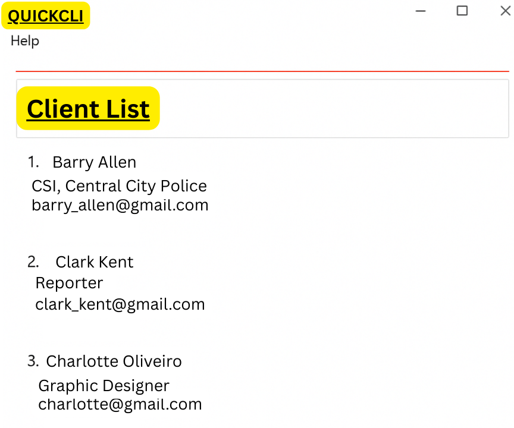

QuickCLI is a **desktop app for managing contacts, optimized for use via a Command Line Interface** (CLI) while still having the benefits of a Graphical User Interface (GUI). If you can type fast, QuickCLI can get your contact management tasks done faster than traditional GUI apps.

--------------------------------------------------------------------------------------------------------------------

## Table of Contents

* [Quick Start](#quick-start)
* [Features](#features)
    * [Viewing help: `help`](#viewing-help-help)
    * [Adding a person: `add`](#adding-a-person-add)
    * [Listing all persons: `list`](#listing-all-persons-list)
    * [Editing a person: `edit`](#editing-a-person-edit)
    * [Locating persons by name: `find`](#locating-persons-by-name-find)
    * [Deleting a person: `delete`](#deleting-a-person-delete)
    * [Adding notes to a person: `note`](#adding-notes-to-a-person-note)
    * [Setting priority for a person: `priority`](#setting-priority-for-a-person-priority)
    * [Sorting contacts: `sort`](#sorting-contacts-sort)
    * [Undoing a command: `undo`](#undoing-a-command-undo)
    * [Redoing a command: `redo`](#redoing-a-command-redo)
    * [Clearing all entries: `clear`](#clearing-all-entries-clear)
    * [Exiting the program: `exit`](#exiting-the-program-exit)
    * [Saving the data](#saving-the-data)
    * [Editing the data file](#editing-the-data-file)
* [FAQ](#faq)
* [Known Issues](#known-issues)
* [Command Summary](#command-summary)
* [Glossary](#glossary)

--------------------------------------------------------------------------------------------------------------------

## Quick Start

1. Ensure you have Java `17` or above installed in your computer.
    * **Mac users:** Please ensure you have the precise JDK version prescribed [here](https://se-education.org/guides/tutorials/javaInstallationMac.html).
    * You can verify your Java version by opening a command terminal and typing `java -version`.

2. Download the latest `.jar` file from [here](https://github.com/AY2526S1-CS2103T-W09-4/tp/releases).

3. Copy the file to the folder you want to use as the _home folder_ for your AddressBook.

4. Open a command terminal and navigate to the folder containing the jar file.
    * **Windows:** Open Command Prompt and use the `cd` command to navigate to the folder.
    * **Mac/Linux:** Open Terminal and use the `cd` command to navigate to the folder.

5. Run the application using the command: `java -jar addressbook.jar`
    * A GUI similar to the one shown below should appear in a few seconds.
    * Note: The app contains some sample data for you to explore.

   

6. Type a command in the command box and press Enter to execute it.
    * Try typing **`help`** and pressing Enter to open the help window.

7. Here are some example commands to get you started:
    * **`list`** : Lists all contacts in the address book.
    * **`add n/John Doe p/98765432 e/johnd@example.com a/John street, block 123, #01-01`** : Adds a contact named `John Doe` to the Address Book.
    * **`note 1 r/Prefers email contact`** : Adds a note to the 1st contact.
    * **`priority 2 pr/HIGH`** : Sets the priority of the 2nd contact to HIGH.
    * **`sort name`** : Sorts all contacts alphabetically by name.
    * **`delete 3`** : Deletes the 3rd contact shown in the current list.
    * **`find John`** : Finds all contacts whose names contain "John".
    * **`undo`** : Undoes the last command.
    * **`clear`** : Deletes all contacts.
    * **`exit`** : Exits the app.

8. Refer to the [Features](#features) section below for detailed information about each command.

--------------------------------------------------------------------------------------------------------------------

## Features

<div markdown="block" class="alert alert-info">

**ℹ️ Notes about the command format:**<br>

* Words in `UPPER_CASE` are the parameters to be supplied by the user.<br>
  e.g. in `add n/NAME`, `NAME` is a parameter which can be used as `add n/John Doe`.

* Items in square brackets are optional.<br>
  e.g. `n/NAME [t/TAG]` can be used as `n/John Doe t/friend` or as `n/John Doe`.

* Items with `…`​ after them can be used multiple times including zero times.<br>
  e.g. `[t/TAG]…`​ can be used as ` ` (i.e. 0 times), `t/friend`, `t/friend t/family` etc.

* Parameters can be in any order.<br>
  e.g. if the command specifies `n/NAME p/PHONE_NUMBER`, `p/PHONE_NUMBER n/NAME` is also acceptable.

* Extraneous parameters for commands that do not take in parameters (such as `help`, `list`, `exit`, `clear`, `undo`, and `redo`) will be ignored.<br>
  e.g. if the command specifies `help 123`, it will be interpreted as `help`.

* If you are using a PDF version of this document, be careful when copying and pasting commands that span multiple lines as space characters surrounding line-breaks may be omitted when copied over to the application.

</div>

### Viewing help: `help`

Shows a message explaining how to access the help page.


**Format:** `help`

**What it does:**
* Opens a pop-up window with a link to this User Guide.
* The help window can be accessed at any time during your use of the application.

--------------------------------------------------------------------------------------------------------------------

### Adding a person: `add`

Adds a person to the address book.

**Format:** `add n/NAME p/PHONE_NUMBER [e/EMAIL] [a/ADDRESS] [c/COMPANY] [r/NOTE] [pr/PRIORITY] [t/TAG]…`​

**Parameters:**
* `n/NAME`: The name of the person (required)
* `p/PHONE_NUMBER`: The phone number of the person (required)
* `e/EMAIL`: The email address of the person (optional)
* `a/ADDRESS`: The address of the person (optional)
* `c/COMPANY`: The company the person works for (optional)
* `r/NOTE`: Optional note or remark about the person
* `pr/PRIORITY`: Optional priority level (HIGH/MEDIUM/LOW or 1-5)
* `t/TAG`: Optional tags to categorize the person (can be used multiple times or omitted)

<div markdown="span" class="alert alert-primary">

💡 **Tip:** You can now add notes and set priority levels directly when adding a new contact! Tags, notes, and priority are all optional fields.

</div>

**Examples:**
* `add n/John Doe p/98765432 e/johnd@example.com a/John street, block 123, #01-01`
    * Adds a contact named John Doe without any tags, notes, or priority.
* `add n/Betsy Crowe t/friend e/betsycrowe@example.com a/Newgate Prison p/1234567 t/criminal`
    * Adds a contact named Betsy Crowe with two tags: "friend" and "criminal".
* `add n/David Li p/91031282 e/lidavid@example.com a/Blk 436 Serangoon Gardens r/Prefers email contact pr/HIGH t/colleague`
    * Adds David Li with a note, HIGH priority, and a "colleague" tag.

**Notes:**
* Only name and phone number are required; all other fields are optional.
* Parameters can be entered in any order.
* Phone numbers should contain only numbers and be at least 3 digits long.
* Email addresses must be in a valid format (e.g., user@domain.com) when provided.
* Priority values can be HIGH, MEDIUM, LOW (case-insensitive) or numeric values 1-5 where 1=HIGH, 3=MEDIUM, 5=LOW.

--------------------------------------------------------------------------------------------------------------------

### Listing all persons: `list`

Shows a list of all persons in the address book.

**Format:** `list`

**What it does:**
* Displays all contacts stored in your address book.
* This is useful after using the [find](#locating-persons-by-name-find) or [sort](#sorting-contacts-sort) commands to return to viewing all contacts in their original order.

**Example:**
* `list` displays all contacts in the address book.

--------------------------------------------------------------------------------------------------------------------

### Editing a person: `edit`

Edits an existing person in the address book.

**Format:** `edit INDEX [n/NAME] [p/PHONE] [e/EMAIL] [a/ADDRESS] [c/COMPANY] [r/NOTE] [pr/PRIORITY] [t/TAG]…`​

**Parameters:**
* `INDEX`: The index number of the person in the displayed list (required). The index **must be a positive integer** (1, 2, 3, …).
* `n/NAME`: The new name for the person (optional)
* `p/PHONE`: The new phone number (optional)
* `e/EMAIL`: The new email address (optional)
* `a/ADDRESS`: The new address (optional)
* `c/COMPANY`: The new company (optional)
* `r/NOTE`: The new note/remark (optional)
* `pr/PRIORITY`: The new priority level (optional)
* `t/TAG`: The new tags (optional, can be used multiple times)

**Important Notes:**
* At least one of the optional fields must be provided.
* The index refers to the index number shown in the currently displayed person list.
* Existing values will be updated to the input values.
* When editing tags, the existing tags of the person will be **replaced entirely** (i.e., adding of tags is not cumulative).
* You can remove all the person's tags by typing `t/` without specifying any tags after it.
* You can remove a note by typing `r/-`.

**Examples:**
* `edit 1 p/91234567 e/johndoe@example.com`
    * Edits the phone number and email address of the 1st person to be `91234567` and `johndoe@example.com` respectively.
* `edit 2 n/Betsy Crower t/`
    * Edits the name of the 2nd person to be `Betsy Crower` and clears all existing tags.
* `edit 3 r/Likes to swim on weekends pr/MEDIUM`
    * Updates the note and sets priority to MEDIUM for the 3rd person.
* `edit 1 r/-`
    * Removes the note from the 1st person.

--------------------------------------------------------------------------------------------------------------------

### Locating persons by name: `find`

Finds persons whose names contain any of the given keywords.

**Format:** `find KEYWORD [MORE_KEYWORDS]`

**Parameters:**
* `KEYWORD`: One or more keywords to search for in contact names.

**How it works:**
* The search is **case-insensitive**. e.g. `hans` will match `Hans`.
* The order of the keywords does not matter. e.g. `Hans Bo` will match `Bo Hans`.
* Only the name is searched (not phone, email, address, tags, or notes).
* Only **full words** will be matched. e.g. `Han` will not match `Hans`.
* Persons matching **at least one keyword** will be returned (i.e. `OR` search).

**Examples:**
* `find John` returns `john` and `John Doe`
* `find alex david` returns `Alex Yeoh` and `David Li`

  

**Tip:** After using the find command, use the [list](#listing-all-persons-list) command to view all contacts again.

--------------------------------------------------------------------------------------------------------------------

### Deleting a person: `delete`

Deletes the specified person from the address book.

**Format:** `delete INDEX`

**Parameters:**
* `INDEX`: The index number of the person in the displayed list. The index **must be a positive integer** (1, 2, 3, …).

**Important Notes:**
* The index refers to the index number shown in the currently displayed person list.
* Be careful when using this command as the deletion is permanent (unless you use [undo](#undoing-a-command-undo)).

**Examples:**
* `list` followed by `delete 2` deletes the 2nd person in the address book.
* `find Betsy` followed by `delete 1` deletes the 1st person in the results of the find command.

<div markdown="span" class="alert alert-warning">

⚠️ **Warning:** Deletion is permanent unless undone immediately. Use the `undo` command to reverse a deletion.

</div>

--------------------------------------------------------------------------------------------------------------------

### Adding notes to a person: `note`

Adds or updates a note/remark for a specific person in the address book.

**Format:** `note INDEX r/NOTE`

**Parameters:**
* `INDEX`: The index number of the person in the displayed list (required). The index **must be a positive integer** (1, 2, 3, …).
* `r/NOTE`: The note content to add or update (required)

**Important Notes:**
* The index refers to the index number shown in the currently displayed person list.
* Adding a note to a person who already has a note will replace the existing note.
* To remove a note, use `r/-` as the note content.
* Notes are automatically timestamped with the last edited date and time.
* Notes cannot be blank (except for the removal placeholder `-`).

**Examples:**
* `note 1 r/Likes to swim on weekends`
    * Adds or updates the note for the 1st person.
* `note 3 r/Prefers email over phone calls`
    * Adds or updates the note for the 3rd person.
* `note 2 r/-`
    * Removes the note from the 2nd person.

<div markdown="span" class="alert alert-primary">

💡 **Tip:** Use notes to store important information about your contacts, such as preferences, special occasions, or meeting notes!

</div>

**Use Cases:**
* Recording communication preferences
* Noting important dates or reminders
* Keeping track of meeting notes
* Storing any other relevant information about the contact

--------------------------------------------------------------------------------------------------------------------

### Setting priority for a person: `priority`

Sets the priority level for a specific person in the address book.

**Format:** `priority INDEX pr/PRIORITY`

**Parameters:**
* `INDEX`: The index number of the person in the displayed list (required). The index **must be a positive integer** (1, 2, 3, …).
* `pr/PRIORITY`: The priority level to set (required)

**Valid Priority Values:**
* **Text format:** `HIGH`, `MEDIUM`, or `LOW` (case-insensitive)
* **Numeric format:** `1` (HIGH), `2`, `3` (MEDIUM), `4`, or `5` (LOW)

**Important Notes:**
* The index refers to the index number shown in the currently displayed person list.
* Priority levels are color-coded in the GUI:
    * HIGH - Red (#ff4444)
    * MEDIUM - Amber (#ffbb33)
    * LOW - Green (#00C851)
* Setting a new priority will replace any existing priority.

**Examples:**
* `priority 1 pr/HIGH`
    * Sets the 1st person's priority to HIGH.
* `priority 3 pr/MEDIUM`
    * Sets the 3rd person's priority to MEDIUM.
* `priority 2 pr/1`
    * Sets the 2nd person's priority to HIGH (using numeric notation).
* `priority 5 pr/LOW`
    * Sets the 5th person's priority to LOW.

<div markdown="span" class="alert alert-primary">

💡 **Tip:** Use priority levels to mark important clients, urgent contacts, or categorize your contacts by importance. You can also sort your contacts by priority!

</div>

**Use Cases:**
* Marking VIP clients or important contacts
* Prioritizing follow-up actions
* Organizing contacts by urgency
* Quick visual identification of key contacts

--------------------------------------------------------------------------------------------------------------------

### Sorting contacts: `sort`

Sorts all persons in the address book by a specified field in ascending order.

**Format:** `sort [FIELD]`

**Parameters:**
* `FIELD`: The field to sort by (optional, defaults to `name` if not specified)

**Valid Sort Fields:**
* `name` - Sorts alphabetically by name (default)
* `phone` - Sorts numerically by phone number
* `email` - Sorts alphabetically by email address
* `address` - Sorts alphabetically by address
* `tag` - Sorts by tags
* `priority` - Sorts by priority level (HIGH → MEDIUM → LOW)

**Important Notes:**
* Sorting is always in ascending order.
* The sort is case-insensitive for text fields (name, email, address).
* After sorting, the list remains sorted until you use another command that changes the order (like [list](#listing-all-persons-list) which restores the original order).
* The sorted order is preserved across commands (e.g., delete, edit) until explicitly changed.

**Examples:**
* `sort` or `sort name`
    * Sorts all contacts alphabetically by name.
* `sort phone`
    * Sorts all contacts by phone number in ascending order.
* `sort priority`
    * Sorts all contacts by priority (HIGH priority contacts appear first).
* `sort email`
    * Sorts all contacts alphabetically by email address.

<div markdown="span" class="alert alert-primary">

💡 **Tip:** Use `sort priority` to quickly see your most important contacts at the top of the list!

</div>

**Use Cases:**
* Finding a contact quickly when you know their name/email
* Organizing contacts by importance (using priority sort)
* Grouping contacts by location (using address sort)
* Creating a phone directory (using phone sort)

--------------------------------------------------------------------------------------------------------------------

### Undoing a command: `undo`

Undoes the previous command that modified the address book data.

**Format:** `undo`

**What it does:**
* Reverses the last command that changed the address book (e.g., add, delete, edit, clear, note, priority).
* Can be used multiple times to undo several commands in sequence.
* Commands that only display information (e.g., list, find, help) are not undoable.

**Important Notes:**
* Only commands that modify the address book data can be undone.
* There is a limit to how many commands can be undone (typically based on history size).
* If there are no actions to undo, an error message will be displayed.

**Examples:**
* After executing `delete 1`, use `undo` to restore the deleted person.
* After executing `clear`, use `undo` to restore all deleted contacts.
* After executing `edit 1 n/John Tan`, use `undo` to revert the name change.

<div markdown="span" class="alert alert-primary">

💡 **Tip:** Made a mistake? Just use `undo` to quickly reverse your last action!

</div>

**Common Use Cases:**
* Accidentally deleted a contact
* Made incorrect edits to a contact
* Cleared the address book by mistake
* Changed your mind about a recent modification

--------------------------------------------------------------------------------------------------------------------

### Redoing a command: `redo`

Redoes a command that was previously undone.

**Format:** `redo`

**What it does:**
* Reverses the most recent `undo` command.
* Can be used multiple times to redo several undone commands in sequence.
* Only works if `undo` was the most recent action affecting the undo/redo history.

**Important Notes:**
* `redo` only works after an `undo` command.
* If you execute a new command that modifies the address book after using `undo`, the redo history is cleared.
* If there are no actions to redo, an error message will be displayed.

**Examples:**
* After using `undo` to reverse a delete command, use `redo` to delete the person again.
* After using `undo` multiple times, use `redo` to reapply those changes.

<div markdown="span" class="alert alert-info">

**ℹ️ Note:** The redo history is cleared when you execute a new command that modifies data. For example: `delete 1` → `undo` → `edit 2 n/John` will clear the redo history, and you cannot redo the delete anymore.

</div>

**Command Sequence Example:**
```
1. add n/John Doe p/98765432 e/john@example.com a/123 Street
2. delete 1
3. undo          (restores John Doe)
4. redo          (deletes John Doe again)
5. undo          (restores John Doe)
6. edit 1 n/Jane (modifies data - redo history cleared)
7. redo          (error: no actions to redo)
```

--------------------------------------------------------------------------------------------------------------------

### Clearing all entries: `clear`

Clears all entries from the address book.

**Format:** `clear`

**What it does:**
* Removes all contacts from your address book.
* This action is useful if you want to start fresh with a new set of contacts.
* Can be undone using the [undo](#undoing-a-command-undo) command.

<div markdown="span" class="alert alert-warning">

⚠️ **Warning:** This action removes all contacts! However, you can use the `undo` command immediately after if this was a mistake. Consider backing up your data file before using this command.

</div>

--------------------------------------------------------------------------------------------------------------------

### Exiting the program: `exit`

Exits the program.

**Format:** `exit`

**What it does:**
* Closes the AddressBook application.
* All data is automatically saved before the application closes.
* Undo/redo history is cleared when you exit the application.

--------------------------------------------------------------------------------------------------------------------

### Saving the data

AddressBook data are saved in the hard disk automatically after any command that changes the data. There is no need to save manually.

**Data file location:**
* Your data is saved as a JSON file at `[JAR file location]/data/addressbook.json`.
* The data file is created automatically when you first run the application.

**What gets saved:**
* All contact information (name, phone, email, address, company)
* Tags associated with each contact
* Notes/remarks with their last edited timestamps
* Priority levels
* All other custom fields

--------------------------------------------------------------------------------------------------------------------

### Editing the data file

AddressBook data are saved automatically as a JSON file `[JAR file location]/data/addressbook.json`. Advanced users are welcome to update data directly by editing that data file.

<div markdown="span" class="alert alert-warning">

⚠️ **Caution:**
If your changes to the data file make its format invalid, AddressBook will discard all data and start with an empty data file at the next run. Hence, it is recommended to take a backup of the file before editing it.

Furthermore, certain edits can cause the AddressBook to behave in unexpected ways (e.g., if a value entered is outside of the acceptable range). Therefore, edit the data file only if you are confident that you can update it correctly.

</div>

**Tips for editing the data file:**
* Make a backup copy before making any changes.
* Use a JSON validator to ensure your edits maintain valid JSON format.
* Ensure all required fields are present for each contact.
* Close the AddressBook application before editing the data file to prevent conflicts.
* Priority values should be stored as their numeric equivalents (1, 3, or 5).
* Note timestamps should be in ISO format if manually editing.

--------------------------------------------------------------------------------------------------------------------

### Archiving data files `[coming in v2.0]`

_Details coming soon..._

--------------------------------------------------------------------------------------------------------------------

## FAQ

**Q: How do I transfer my data to another computer?**<br>
**A:** Install the app in the other computer and overwrite the empty data file it creates with the file that contains the data of your previous AddressBook home folder. The data file is located at `[JAR file location]/data/addressbook.json`.

**Q: Can I use the app without an internet connection?**<br>
**A:** Yes! AddressBook is a fully offline application and does not require an internet connection to function.

**Q: What happens to my undo/redo history when I close the app?**<br>
**A:** The undo/redo history is cleared when you exit the application. Make sure any important changes are finalized before exiting.

**Q: How many levels of undo/redo are supported?**<br>
**A:** The application maintains a history of recent changes, allowing you to undo/redo multiple commands in sequence. The exact limit depends on the implementation but is typically sufficient for normal usage.

**Q: What should I do if the app doesn't start?**<br>
**A:**
* Ensure you have Java 17 or above installed. You can check by running `java -version` in your command terminal.
* Make sure you're using the correct command: `java -jar addressbook.jar`
* Check that the jar file is not corrupted by re-downloading it from the releases page.

**Q: Can I run multiple instances of AddressBook?**<br>
**A:** Yes, but be careful not to have multiple instances accessing the same data file simultaneously, as this may lead to data corruption.

**Q: How do I update to a newer version?**<br>
**A:** Download the latest jar file and replace your old jar file. Your data file will be preserved as long as it's in the data folder.

**Q: Why can't I find a contact I just added?**<br>
**A:** If you previously used the `find` command, you might be viewing a filtered list. Use the `list` command to view all contacts.

**Q: Can I search contacts by tags, priority, or notes?**<br>
**A:** Currently, the `find` command only searches by name. However, you can use the `sort` command to organize contacts by priority. Advanced search features may be added in future versions.

**Q: What's the difference between editing a note with the `edit` command vs. the `note` command?**<br>
**A:** Both achieve the same result. The `note` command is a dedicated command specifically for updating notes, while `edit` is more general and can update multiple fields at once. Use whichever feels more natural to you!

**Q: Can I undo a `clear` command?**<br>
**A:** Yes! The `clear` command can be undone using the `undo` command, which will restore all your contacts.

--------------------------------------------------------------------------------------------------------------------

## Known Issues

1. **When using multiple screens**, if you move the application to a secondary screen, and later switch to using only the primary screen, the GUI will open off-screen. The remedy is to delete the `preferences.json` file created by the application before running the application again.

2. **If you minimize the Help Window** and then run the `help` command (or use the `Help` menu, or the keyboard shortcut `F1`) again, the original Help Window will remain minimized, and no new Help Window will appear. The remedy is to manually restore the minimized Help Window.

3. **Undo/redo with rapid consecutive commands** may occasionally behave unexpectedly if commands are executed faster than the system can process them. Allow each command to complete before executing the next one.

--------------------------------------------------------------------------------------------------------------------

## Command Summary

| Action         | Format, Examples                                                                                                                                                                          |
|----------------|-------------------------------------------------------------------------------------------------------------------------------------------------------------------------------------------|
| **Add**        | `add n/NAME p/PHONE_NUMBER [e/EMAIL] [a/ADDRESS] [c/COMPANY] [r/NOTE] [pr/PRIORITY] [t/TAG]…`​<br>e.g., `add n/James Ho p/22224444 e/jamesho@example.com a/123, Clementi Rd c/Google r/Likes coffee pr/HIGH t/friend t/colleague` |
| **Clear**      | `clear`                                                                                                                                                                                   |
| **Delete**     | `delete INDEX`<br>e.g., `delete 3`                                                                                                                                                        |
| **Edit**       | `edit INDEX [n/NAME] [p/PHONE_NUMBER] [e/EMAIL] [a/ADDRESS] [c/COMPANY] [r/NOTE] [pr/PRIORITY] [t/TAG]…`​<br>e.g., `edit 2 n/James Lee e/jameslee@example.com c/Microsoft pr/MEDIUM`                            |
| **Find**       | `find KEYWORD [MORE_KEYWORDS]`<br>e.g., `find James Jake`                                                                                                                                |
| **List**       | `list`                                                                                                                                                                                    |
| **Note**       | `note INDEX r/NOTE`<br>e.g., `note 1 r/Likes to swim on weekends`                                                                                                                        |
| **Priority**   | `priority INDEX pr/PRIORITY`<br>e.g., `priority 2 pr/HIGH`                                                                                                                               |
| **Sort**       | `sort [FIELD]`<br>e.g., `sort name`, `sort priority`, `sort phone`                                                                                                                       |
| **Undo**       | `undo`                                                                                                                                                                                    |
| **Redo**       | `redo`                                                                                                                                                                                    |
| **Help**       | `help`                                                                                                                                                                                    |
| **Exit**       | `exit`                                                                                                                                                                                    |

--------------------------------------------------------------------------------------------------------------------

## Glossary

* **CLI (Command Line Interface)**: A text-based interface where you type commands to interact with the application.
* **GUI (Graphical User Interface)**: A visual interface with buttons, menus, and other graphical elements.
* **JSON (JavaScript Object Notation)**: A lightweight data format used to store the address book data.
* **JAR (Java Archive)**: The file format used to distribute the AddressBook application.
* **Index**: The position number of a contact in the displayed list (starting from 1).
* **Tag**: A label or category that can be assigned to contacts for organizational purposes.
* **Parameter**: A value that you provide to a command (e.g., the name in `n/NAME`).
* **Company**: The organization or workplace associated with a contact.
* **Note/Remark**: A text field for storing additional information about a contact, such as preferences or important details.
* **Priority**: A classification level (HIGH, MEDIUM, or LOW) assigned to contacts to indicate their relative importance.
* **Prefix**: The identifier before a parameter value (e.g., `n/` for name, `r/` for note, `pr/` for priority).
* **Undo/Redo History**: The sequence of commands that have been executed, allowing you to reverse or reapply changes.

--------------------------------------------------------------------------------------------------------------------

## Prefix Reference

Here's a quick reference for all the prefixes used in commands:

| Prefix | Field       | Description                      | Example          |
|--------|-------------|----------------------------------|------------------|
| `n/`   | Name        | Person's full name               | `n/John Doe`     |
| `p/`   | Phone       | Phone number                     | `p/98765432`     |
| `e/`   | Email       | Email address                    | `e/john@example.com` |
| `a/`   | Address     | Physical address                 | `a/123 Street`   |
| `c/`   | Company     | Company name                     | `c/Google`       |
| `r/`   | Remark/Note | Additional notes or remarks      | `r/Likes coffee` |
| `pr/`  | Priority    | Priority level (HIGH/MEDIUM/LOW) | `pr/HIGH`        |
| `t/`   | Tag         | Category or label                | `t/friend`       |

--------------------------------------------------------------------------------------------------------------------

*This User Guide is for QuickCLI. For more information, visit the [project repository](https://github.com/AY2526S1-CS2103T-W09-4/tp).*